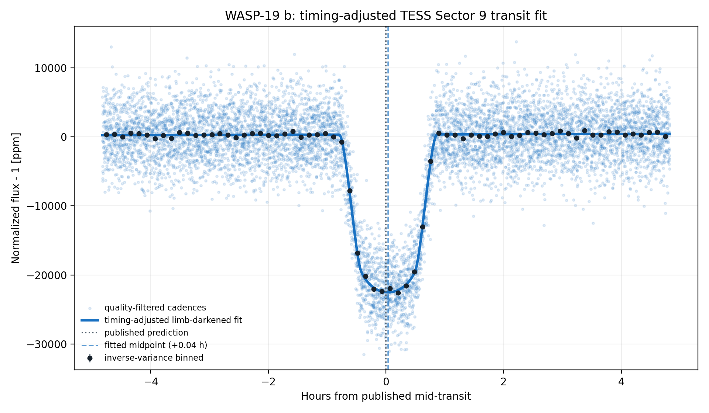
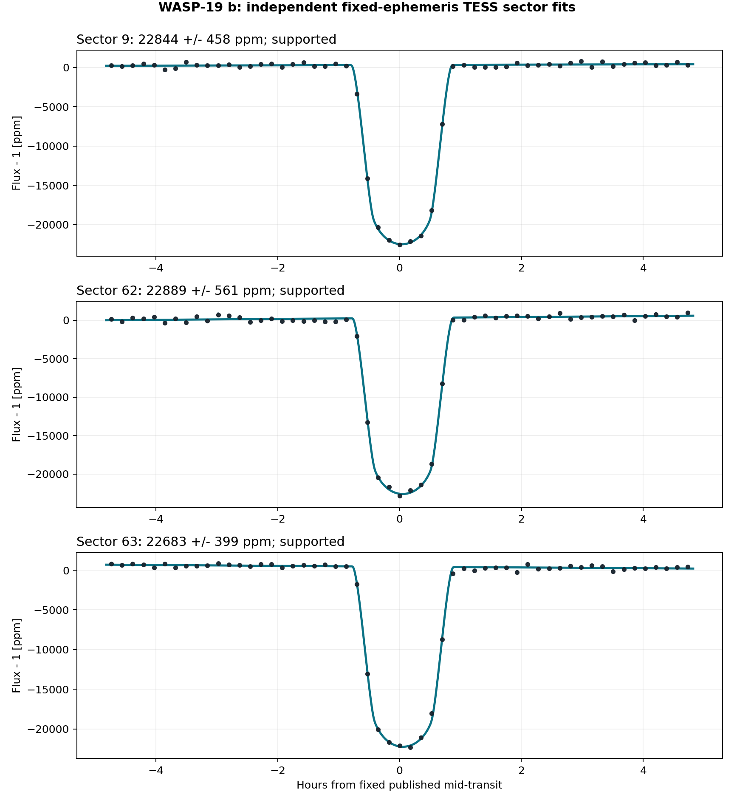
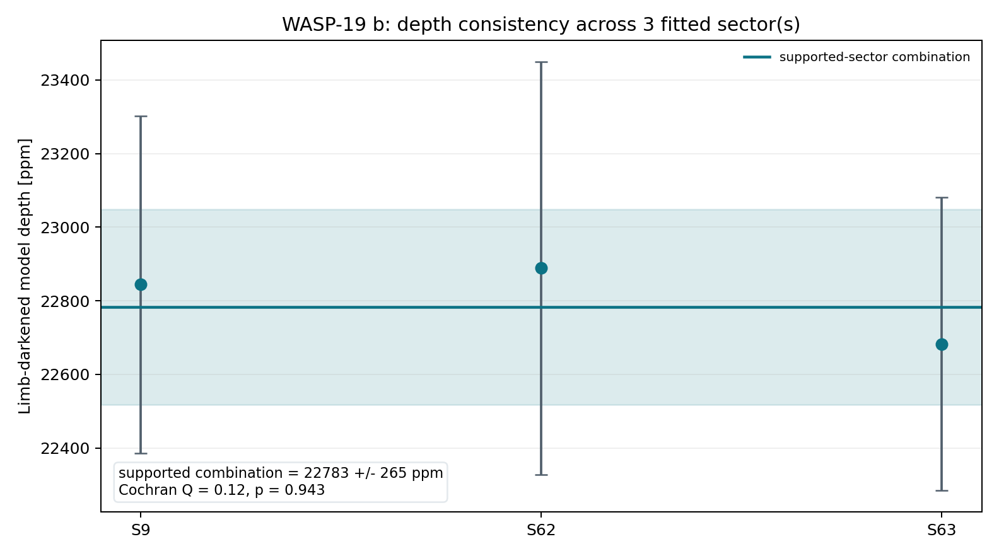
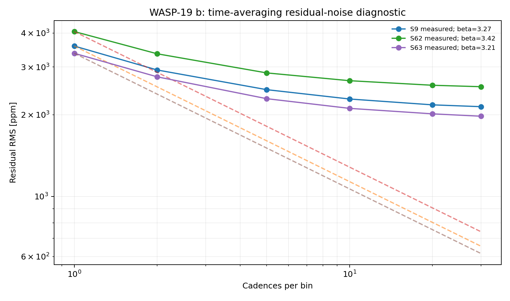
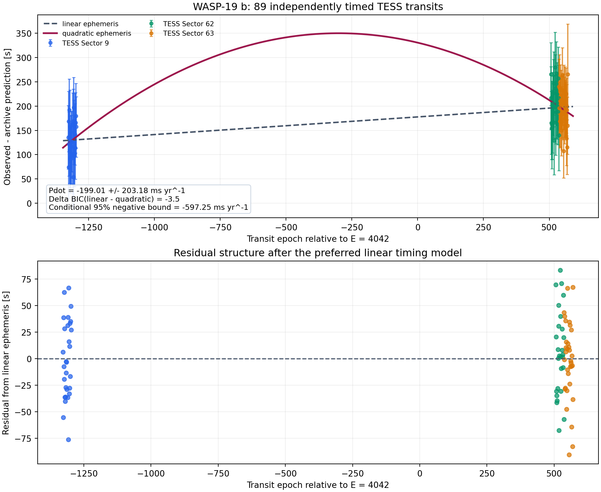

# WASP-19 b: One Day in the Life of a Hot Jupiter
<!-- RESEARCH-IDENTITY-START -->
**Independent research report by [Biswajit Jana](https://biswajit1999.github.io/Biswajit_Jana.github.io/)** · [Live report](https://biswajit1999.github.io/wasp-19b-exoplanet-report/) · [ORCID](https://orcid.org/0009-0002-2411-1891) · [Complete research portfolio](https://biswajit1999.github.io/Biswajit_Jana.github.io/research/exoplanets/)
<!-- RESEARCH-IDENTITY-END -->


<!-- TARGET-IDENTITY-START -->
<p align="center">
  
</p>

<p align="center"><em>AI-generated artist's interpretation informed by the measured system properties; not a direct image.</em></p>

**Ultra-short-period giant · stellar activity · TESS**

A hot Jupiter completing an orbit in under a day, analyzed with timing freedom and explicit noise inflation in a regime where irradiation and stellar variability matter.
<!-- TARGET-IDENTITY-END -->
<p align="center">
  
</p>


**[Open the full report](https://biswajit1999.github.io/wasp-19b-exoplanet-report/)** — the live GitHub Pages version.

## Data sources

- **System parameters** — the saved `pscomppars` row from the [NASA Exoplanet Archive TAP service](https://exoplanetarchive.ipac.caltech.edu/TAP/sync?query=select+pl_name%2Chostname%2Cra%2Cdec%2Cpl_orbper%2Cpl_tranmid%2Cpl_trandur%2Cpl_rade%2Cpl_bmasse%2Cpl_eqt%2Cpl_orbsmax%2Csy_dist%2Csy_tmag%2Cst_teff%2Cst_rad%2Cst_mass%2Cdisc_year%2Cdiscoverymethod%2Cdisc_refname%2Cdisc_pubdate%2Cdisc_facility+from+pscomppars+where+pl_name%3D%27WASP-19+b%27&format=csv).
- **Observed photometry** — unmodified MAST file `tess2019058134432-s0009-0000000035516889-0139-s_lc.fits`, TESS Sector 9, DOI [10.17909/t9-nmc8-f686](https://doi.org/10.17909/t9-nmc8-f686). This is a real SPOC reduced light curve, not simulated data.
- Exact URLs, IDs, retrieval date, and SHA-256 checksum are in [`data/SOURCE.md`](data/SOURCE.md).

## Reproduce the analysis

```bash
pip install -r requirements.txt
python scripts/analyze_transit.py
python scripts/analyze_multisector.py
python scripts/analyze_timing_limits.py
pytest tests/ -v
```

The script keeps finite `QUALITY == 0` cadences, normalizes `PDCSAP_FLUX`, and applies one symmetric robust outlier rule. A local linear null is compared with a circular quadratic-limb-darkened transit. The archive period and predicted phase are retained, while midpoint, radius ratio, impact parameter, baseline, and baseline slope are fitted inside a bounded window. The limb-darkening coefficients and scaled semi-major axis are fixed and disclosed in the CSV.

## What the corrected fit shows

| Quantity | Result |
|---|---:|
| TESS sector | 9 |
| Cadences in fitted window | 8212 |
| Transit support | ΔBIC ≥ 10 |
| Midpoint correction | +0.036 h ± 0.15 min |
| Model mid-transit depth | 22844.2 ± 140.2 ppm |
| Radius ratio Rp/Rs | 0.14738 |
| Fitted / published duration | 1.648 / 1.607 h |
| Linear null χ² / dof / BIC | 56047.03 / 8210 / 56065.05 |
| Transit χ² / dof / BIC | 11554.80 / 8207 / 11599.87 |
| ΔBIC (null − transit) | 44465.19 |

The timing-adjusted transit is strongly preferred by ΔBIC = 44465.2. Its fitted midpoint is +0.036 hours from the historical prediction; the model's mid-transit depth is 22844.2 ± 140.2 ppm. A fitted timing correction can diagnose ephemeris drift, but this single-sector fit is not a replacement for a global transit-timing analysis.

<!-- MULTISECTOR-UPGRADE-START -->
## Multi-sector robustness and correlated noise

The archive prediction was timing-adjusted independently in 3 fitted sector(s) (S9, S62, S63), of which 3 meet Delta BIC >= 10. Formal depth errors were inflated by sqrt(max(reduced chi-square, 1)) times the residual time-averaging beta factor (observed range 3.21-3.42). The robust inverse-variance model depth across supported sectors is 22782.8 +/- 265.1 ppm; Cochran Q = 0.12 for 2 dof (p = 0.9433). These scaled errors address underestimated scatter and short-timescale correlation, but they are not a full Gaussian-process or physical limb-darkened transit fit.

<p align="center"></p>

<p align="center"></p>

<p align="center"></p>

The per-sector table is in [`figures/multisector_statistics.csv`](figures/multisector_statistics.csv). Regenerate all three figures with `python scripts/analyze_multisector.py`.
<!-- MULTISECTOR-UPGRADE-END -->

## What can TESS alone say about orbital evolution?

<p align="center"></p>

This repository independently measures **89 transits** from TESS Sectors 9, 62, and 63 over 1,496 days. Each event uses a fixed sector-level transit shape while fitting its midpoint and local baseline. Its timing uncertainty is inflated by both a residual time-averaging factor and an empirical sector jitter of 34–47 seconds.

The result is a useful negative sensitivity test:

- a linear ephemeris is preferred over a quadratic one, with **Delta BIC(linear - quadratic) = -3.5**;
- the conditional TESS-only estimate is **Pdot = -199 +/- 203 ms yr-1**;
- the corresponding 95% negative bound is approximately **Pdot > -597 ms yr-1** under the stated Gaussian and equilibrium-tide assumptions;
- that bound implies only **Q' star > 4.7 x 10^3**, far weaker than published long-baseline constraints.

The large uncertainty is the scientific result: Sectors 62 and 63 are adjacent, leaving a long gap after Sector 9. A quadratic curve can bend almost unconstrained inside that gap, so the three-sector TESS sampling cannot test the few-ms-per-year regime discussed in the literature. The repository therefore does **not** claim a decay detection or a competitive tidal-quality limit.

This conclusion also clarifies why longer baselines and alternative dynamical models matter. Petrucci et al. (2020) preferred a constant period over a ten-year baseline. Rajkumar et al. (2026), using a substantially enlarged 15-year dataset, found systematic non-linear timing structure better described by a cubic ephemeris and interpreted it as possible gradual apsidal precession rather than monotonic tidal decay. The TESS-only calculation here cannot distinguish those long-baseline scenarios.

Machine-readable event timings are in [`figures/individual_transit_timings.csv`](figures/individual_transit_timings.csv), and the complete model comparison is in [`figures/timing_limit_statistics.csv`](figures/timing_limit_statistics.csv).

## System context

- Radius: 15.86 Earth radii
- Mass: 366.77 Earth masses
- Orbital period: 0.788839 days
- Transit duration: 1.607 hours
- Semi-major axis: 0.0165 AU
- Equilibrium temperature: 2113 K
- Host: WASP-19 · distance 268.32 pc
- Discovery: 2009 by Transit (SuperWASP)

## Limitations

- The orbit is assumed circular and the quadratic limb-darkening coefficients are fixed representative values; they are not atmosphere-grid interpolations.
- The scaled semi-major axis is derived from the saved composite semi-major axis and stellar radius; their uncertainties are not propagated.
- Midpoint freedom corrects accumulated ephemeris error but introduces a bounded timing search. ΔBIC, not a naïve one-parameter p-value, is used as the support gate.
- PDCSAP processing, dilution, stellar variability, transit-timing variations, and long-timescale covariance can still bias the inferred geometry.
- Radius ratio, impact parameter, and fixed limb darkening are correlated. Published global fits with physical priors and simultaneous detrending remain authoritative.
- Individual transit timings share sector-level detrending and stellar-activity systematics; adding a per-sector jitter reduces formal overconfidence but does not make the events fully independent.
- The TESS sampling consists of one early sector and two adjacent late sectors. The reported Pdot interval is therefore conditional on a quadratic ephemeris and should not be used to reject apsidal precession or other secular models.

## Repository structure

```text
README.md
index.html
requirements.txt
data/                       unmodified TESS FITS + NASA row + SOURCE.md
scripts/analyze_transit.py  timing-adjusted limb-darkened transit fit
scripts/analyze_timing_limits.py  individual transit timing + ephemeris limits
figures/                    generated plot + summary_statistics.csv
tests/                      real-data regression tests
.github/workflows/tests.yml CI on every push and pull request
LICENSE                     MIT
```

## References

1. [Hebb et al. 2010](https://ui.adsabs.harvard.edu/abs/2010ApJ...708..224H/abstract) — discovery reference as listed by the NASA Exoplanet Archive.
2. Ricker, G. R. et al. (2015), *Transiting Exoplanet Survey Satellite (TESS)*, JATIS 1, 014003, [doi:10.1117/1.JATIS.1.1.014003](https://doi.org/10.1117/1.JATIS.1.1.014003).
3. TESS Team, *TESS Light Curves — All Sectors*, MAST, [doi:10.17909/t9-nmc8-f686](https://doi.org/10.17909/t9-nmc8-f686); Sector 9 used here.
4. [NASA Exoplanet Archive](https://exoplanetarchive.ipac.caltech.edu/), `pscomppars` TAP row retrieved 2026-08-15.
5. Petrucci, R. et al. (2020), *Discarding orbital decay in WASP-19b after one decade of transit observations*, [arXiv:1910.11930](https://arxiv.org/abs/1910.11930).
6. Rajkumar, A. R. et al. (2026), *Long-term monitoring of WASP-19 b: Signs of apsidal precession and molecular signatures*, [doi:10.1051/0004-6361/202556822](https://doi.org/10.1051/0004-6361/202556822).

## Author

Biswajit Jana — [Portfolio](https://biswajit1999.github.io/Biswajit_Jana.github.io/) · [GitHub](https://github.com/Biswajit1999) · [LinkedIn](https://www.linkedin.com/in/biswajit-jana-27011a151/) · [ORCID](https://orcid.org/0009-0002-2411-1891)
